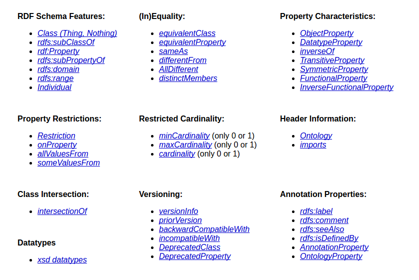
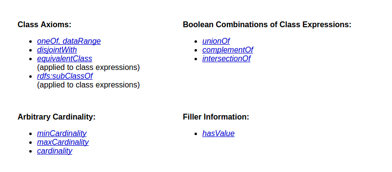

# OWL简介

## 1. 概述

[owl](https://www.w3.org/TR/2004/REC-owl-features-20040210/)

OWL是一种本体描述语言，用于描述文档的信息供应用程序理解和使用。它能够明确地表示一个概念（term）的意义和概念之间的关系。

`本体（notes.ontology）`指的就是这些术语的表示和术语之间的关系。

### 1.1 OWL的子语言

OWL提供三种子语言（语言表达能力逐渐增强）：

* OWL Lite从 语法上来说，OWL-Lite是三个之中最简单的一个，当你的本体中类的层次结构很简单，并且只有简单的约束（constraint）时适合使用它来描述本体
* OWL DL 和 OWL-Lite相比，OWL-DL的表达能力要丰富许多，它的基础是描述逻辑（Description Logics，即DL的由来）。描述逻辑是一阶逻辑（First Order Logic）的一个可判定的变种（译注：不一定准确，原文decidable fragment），因此可以用来进行自动推理，计算机从而可以知道本体中的分类层次，以及本体中的各种概念是否一致
* OWL Full是OWL的三种子语言中表达能力最强的一个，适合在那些需要非常强的表达能力，而不用太关心可判定性（decidability）或是计算完全性的场合下使用。不过也正是由于表达能力太强这个原因，用OWL-Full表示的本体是不能进行自动推理的。

这三种子语言是包含关系，分别是OWL Full>OWL DL>OWL Lite，OWL Full是最大的集合。

### 1.2 OWL Lite纲要

OWL Lite主要包含以下关系描述：



可以看到这些关系术语都是很贴近计算机编程的，例如类、属性、数据类型等等。

### 1.3 OWL DL和OWL Full纲要



## 2. OWL Lite的术语描述

简介关系描述的具体含义

TBD).

## 2. 本体描述文件

[owl guide](https://www.w3.org/TR/owl-guide/)

### 2.1 命名空间（Namespace）

在我们使用术语之前，我们需要通过命名空间来指定本体使用了哪些词汇。一个典型的本体描述文件都会以命名空间声明开头。

```xml
<rdf:RDF 
    xmlns ="http://www.w3.org/TR/2004/REC-owl-guide-20040210/wine#" 
    xmlns:vin ="http://www.w3.org/TR/2004/REC-owl-guide-20040210/wine#"       
    xml:base="http://www.w3.org/TR/2004/REC-owl-guide-20040210/wine#"       
    xmlns:food="http://www.w3.org/TR/2004/REC-owl-guide-20040210/food#"    
    xmlns:owl ="http://www.w3.org/2002/07/owl#"
    xmlns:rdf ="http://www.w3.org/1999/02/22-rdf-syntax-ns#"
    xmlns:rdfs="http://www.w3.org/2000/01/rdf-schema#"
    xmlns:xsd ="http://www.w3.org/2001/XMLSchema#">
</rdf:RDF>
```

属性值不具有命名空间，在OWL里可以写出它们的完整URI，完整的URI可以利用实体定义来简略。

```xml
<!DOCTYPE rdf:RDF [
    <!ENTITY vin  "http://www.w3.org/TR/2004/REC-owl-guide-20040210/wine#" >
    <!ENTITY food "http://www.w3.org/TR/2004/REC-owl-guide-20040210/food#" > ]>
```

上面的命名空间就可以简写成为：

```xml
<rdf:RDF 
    xmlns     ="&vin;" 
    xmlns:vin ="&vin;" 
    xml:base  ="&vin;" 
    xmlns:food="&food;"
    xmlns:owl ="http://www.w3.org/2002/07/owl#"
    xmlns:rdf ="http://www.w3.org/1999/02/22-rdf-syntax-ns#"
    xmlns:rdfs="http://www.w3.org/2000/01/rdf-schema#"
    xmlns:xsd ="http://www.w3.org/2001/XMLSchema#">
 </rdf:RDF>
```

### 2.2 本体头部

在`owl:Ontology`标签中给出本体的声明。来看一个例子：

```xml
<owl:Ontology rdf:about=""> 
  <rdfs:comment>An example OWL ontology</rdfs:comment>
  <owl:priorVersion rdf:resource="http://www.w3.org/TR/2003/PR-owl-guide-20031215/wine"/> 
  <owl:imports rdf:resource="http://www.w3.org/TR/2004/REC-owl-guide-20040210/food"/> 
  <rdfs:label>Wine Ontology</rdfs:label>
</owl:Ontology>
```

其中

* `owl:Ontology`标签内收集了文档的OWL元数据。
* `rdf:about`属性为本体提供一个名称或引用。当值为""时，表示本体的名称为base URI。
* `rdfs:comment`用于描述本体。
* `owl:priorVersion`为本体版本控制提供相关信息的标准标签。
* `owl:imports`提供一种嵌入机制，接受一个用`rdf:resource`属性标识的参数。

## 3. 基本元素

大多数OWL本体的元素都是关于

* classes
* properties
* instances of classes
* relationships between instances

### 3.1 简单的类（Classes）和个体（Individuals）

`extension(外延)`：属于某个类的个体所构成的集合为该类的外延。


#### 3.1.1 简单的命名类

一个领域中最基本的概念对应各个分类层次树的根。

在OWL中，每一个个体都是类`owl:Thing`的成员（基类，类似于Java中的Object）。因此每个自定义的类都是`owl:Thing`的子类。

在OWL中，可以通过`owl:Nothing`来定义一个空的类。

特定领域的根类可以通过声明一个命名类来定义。

```xml
<owl:Class rdf:ID="Winery" />
<owl:Class rdf:ID="Region"/> 
<owl:Class rdf:ID="ConsumableThing"/> 
```


