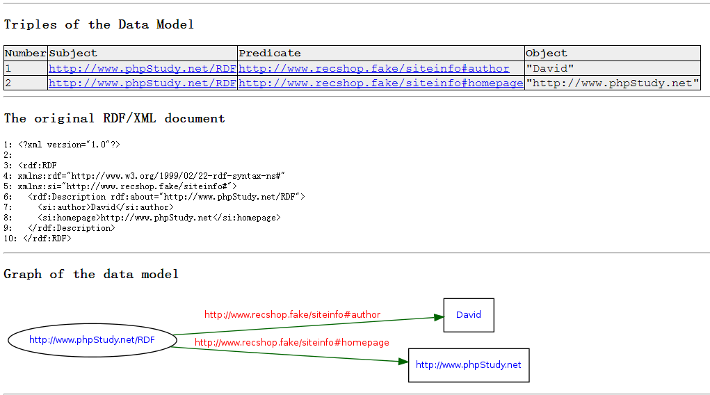

# RDF

## 1. 基本概念

RDF（Resource Definition Framework），资源描述框架，是用于描述网络资源的W3C的标准。它被设计为可被计算机阅读和理解，是W3C的语义网活动的组成部分。

## 2. RDF数据模型

### 2.1 三元组(Triples)

RDF采用三元组（Triple）集合的形式构建Web数据的语义描述模型，一个三元组包括：

1. 主体（subject）
2. 谓词（predicate）
3. 客体（object）

即有等式

Triples = statement = subject + predicate + object

相同的资源可以在一个三元组中处于主体位置，在另一个中处于客体位置，这就有可能找到三元组间的连接。

在一个RDF图(见RDF表示)，

1. 节点：主体\客体
2. 弧：谓词


### 2.2 RDF陈述(statement)

以上面的为例子，陈述："The author of http://www.phpStudy.net/rdf is Zhang"，可以表示为一个RDF陈述，即

* 主体(Subject)是：http://www.phpStudy.net/rdf
* 谓语(Predicate)是：author
* 客体(Object)是：Zhang

### 2.3 IRI(资源)

IRI，即Internatinal Resource Indentifier，标识一个资源，可以是三元组的任意位置。

### 2.4 Literal(文字)

非IRI的基本值，只能出现在三元组的客体位置，数据类型有

* 字符串
* 日期
* 数值
* XML Schema定义的数据类型

### 2.5 Blank Nodes(空节点)

用于表示无需使用IRI明确标识的资源，可以出现在主体和客体位置

### 2.6 Multiple Graphs(多图)

多图构成一个RDF数据集，有多个命名图(named graph)和至多一个未命名图(default)，关联改图的IRI称为`Graph Name`

### 2.7 RDF Vocabularies(RDF词表)

RDF用RDFs语言定义词表：

* 关系
* 类别（类/子类，属性/子属性）
* 限制（领域/范围）

词表由重用获得其价值，被其他重用的词表IRI越多，使用该IRI越有价值，这意味着应该首选重用其他人的IRI，而非发明新的。

### 2.8 RDF图的语义

所谓的语义，就是系统能够做逻辑推论，当给出某个接受为真的导入三元组集，在某些情况下，系统能够推论出其他三元组在逻辑上必须也是真的。

当一种特定的推论似乎对许多不同应用有用时，可被记录为一个蕴涵体制(SPARQL用语义扩展)。RDF语义中指定了多个蕴涵体制。

## 3. RDF表示

### 3.1 N-Triples

常用于交换大量的RDF，以及面向行的文本处理工具处理大的RDF图，每行代表一个三元组，用尖括号封闭完整的IRI，句点表示三元组结束。

```
<http://example.org/bob#me> <http://www.w3.org/1999/02/22-rdf-syntax-ns#type> <http://xmlns.com/foaf/0.1/Person>
```

### 3.2 Turtle

支持命名空间前缀、列表和数据类型串的速写，如

```
@base <http://example.org/>
@prefix foaf: <http://xmlns.com/foaf/0.1/>
@prefix rdfs: <http://www.w3.org/2000/01/rdf-schema#>
<bob#me> a foaf:Person
```

其中

1. `base`提供IRI缩写，基于IRI，例如`<bob#me>`就是相对的IRI，要根据`base`来进行解析。
2. `prefix`则是定义一个命名空间前缀。
3. `a foaf:Person`中，谓词a是属性`rdf:type`的速写，表示实例关系。

### 3.3 TriG(Turtle的扩展)

每个图中的三元组用花括号括起来，其他的句法与Turtle一直，关键词`Graph`可选，可以提高可读性。

```
Graph <http://exmaple.org/bob>
@base <http://example.org/>
@prefix foaf: <http://xmlns.com/foaf/0.1/>
@prefix rdfs: <http://www.w3.org/2000/01/rdf-schema#>
{
    <bob#me> a foaf:Person
}
```

### 3.4 N-Quads(四元组)

N-Triples的多图扩展，四元组，在一行中加入第4个元素，捕捉该行描述三元组的图IRI，如

```
<http://example.org/bob#me> <http://www.w3.org/1999/02/22-rdf-syntax-ns#type> <http://xmlns.com/foaf/0.1/Person> <http://example.org/bob>
```

### 3.5 JSON-LD

基于json的RDF句法，以最小的变化转换JSON文档为RDF

### 3.6 RDFa

用于在HTML/XML文档中嵌入RDF数据

### 3.7 RDF/XML形式

RDF使用XML编写，通过XML，RDF信息可以轻易地在使用不同类型的操作系统和应用语言的计算机之间进行交换。如下，一个简单的rdf文件内容示例。



本图是有W3C的一个在线工具[Validator](http://www.w3.org/RDF/Validator/)生成的。


## 4. RDF与Jena

以下只会出现代码片段，完整的示例[在这里](../rdf/)

### 4.1 数据模型表示

在Jena中，由类`Model`来创建一个内存中的RDF数据模型，一个基本的RDF数据模型通过以下几个类表示：

1. Resource(资源)：RDF描述的各种事物都被称作资源（URI），用来表示RDF三元组中的主体。
2. Proprety(属性)：属性是资源的一个特定的方面，特征，或者是用来描述资源间的关系，用来表示RDF三元组的谓词。
3. RDFNode(RDF节点)，是Resource和Literal的超类，用来表示客体。
3. Statement(声明)：一个Statement可以直接声明一个三元组，包含主体、谓词和客体三个独立的部分。

```java
// 使用工厂模式，创建一个model
Model model = Model.createDefaultModel();

// 创建资源
Resource r1 = model.createResource("http://example/r1");
Resource r2 = model.createResource("http://exmaple/r2");

// 创建一个属性来描述资源
Property kindOf = model.createProperty("http://example/relation/kindOf", "kindOf");

// 组成一个三元组
r1.addProperty(kindOf, r2);

// 也可以直接声明一个三元组
Statement s1 = model.createStatement(r1, kindOf, r2);
model.add(s1);
```

### 4.2 数据遍历与查询

### 4.3 模型操作

### 4.4 持久化