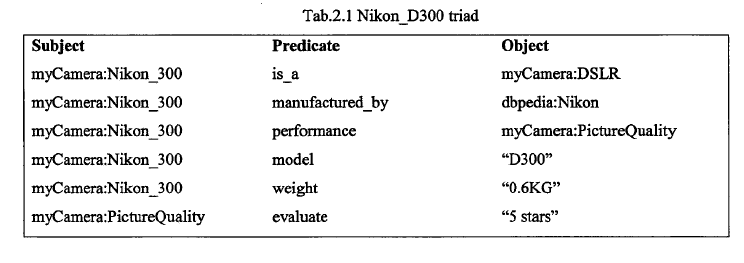
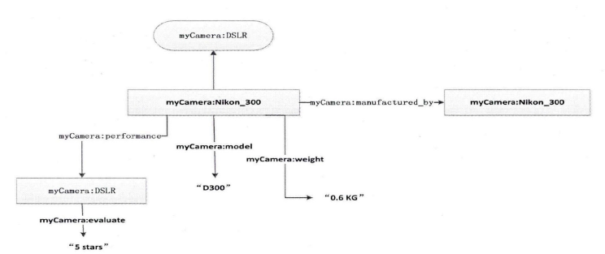

# RDF

## 1. 基本概念

RDF（Resource Definition Framework），资源描述框架，是用于描述网络资源的W3C的标准。它被设计为可被计算机阅读和理解，是W3C的语义网活动的组成部分。

## 2. RDF三元组

RDF采用三元组（Triple）集合的形式构建Web数据的语义描述模型，一个三元组包括：

1. 主体（subject）
2. 谓词（predicate）
3. 客体（object）

### 2.1 RDF规则

1. 使用Web标识符（URIs）来标识资源，例如"http://www.phpStudy.net/rdf"
2. 使用属性来描述资源，例如"author"或"homepage"
3. 属性值是某个属性的值，例如"zhang"或"http://www.phpStudy.net"，注意一个属性值可以是另外一个资源

### 2.2 RDF陈述

以上面的为例子，陈述："The author of http://www.phpStudy.net/rdf is Zhang"，可以表示为一个RDF陈述，即

* 主体(Subject)是：http://www.phpStudy.net/rdf
* 谓语(Predicate)是：author
* 客体(Object)是：Zhang

## 3. RDF表示

### 3.1 表格形式



### 3.2 图



### 3.3 XML形式

RDF使用XML编写，通过XML，RDF信息可以轻易地在使用不同类型的操作系统和应用语言的计算机之间进行交换。如下，一个简单的rdf文件内容示例。


### 3.4 完整示例


本图是有W3C的一个在线工具[Validator](http://www.w3.org/RDF/Validator/)生成的。

## 4. RDF与Jena

以下只会出现代码片段，完整的示例[在这里](../rdf/)

### 4.1 数据模型表示

在Jena中，由类`Model`来创建一个内存中的RDF数据模型，一个基本的RDF数据模型通过以下几个类表示：

1. Resource(资源)：RDF描述的各种事物都被称作资源（URI），用来表示RDF三元组中的主体。
2. Proprety(属性)：属性是资源的一个特定的方面，特征，或者是用来描述资源间的关系，用来表示RDF三元组的谓词。
3. RDFNode(RDF节点)，是Resource的超类，用来表示客体。
3. Statement(声明)：一个Statement可以直接声明一个三元组，包含主体、谓词和客体三个独立的部分。

```java
// 使用工厂模式，创建一个model
Model model = Model.createDefaultModel();

// 创建资源
Resource r1 = model.createResource("http://example/r1");
Resource r2 = model.createResource("http://exmaple/r2");

// 创建一个属性来描述资源
Property kindOf = model.createProperty("http://example/relation/kindOf", "kindOf");

// 组成一个三元组
r1.addProperty(kindOf, r2);

// 也可以直接声明一个三元组
Statement s1 = model.createStatement(r1, kindOf, r2);
model.add(s1);
```

### 4.2 数据遍历与查询

### 4.3 模型操作

### 4.4 持久化