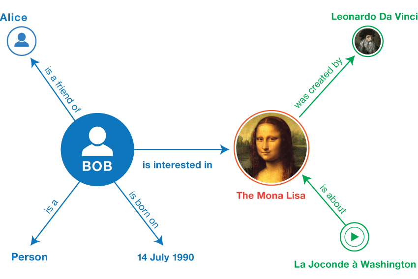

# RDF

## 1. 基本概念

RDF（Resource Definition Framework），资源描述框架，是用于描述网络资源的W3C的标准。它被设计为可被计算机阅读和理解，是W3C的语义网技术的重要的组成部分。

### 1.1 三元组（Triples）

RDF采用三元组（Triple）集合的形式构建Web数据的语义描述模型，就像自然语言中的一个语句，一个三元组包括：

1. 主体（subject）
2. 谓词（predicate）
3. 客体（object）

主体、谓词和客体都采用统一资源描述符（Uniform Resource Identifier， URI）标识。URI标识了Web上唯一的一个资源，并且通过链接引用资源，从而保证RDF中的概念不仅仅是文字，还可以在Web上找到定义描述信息。

### 1.2 RDF Graph（RDF图）

一个三元组形式的语句就表示一条RDF数据，即有等式

    Triples = statement = subject + predicate + object

相同的资源可以在一个三元组中处于主体位置，在另一个中处于客体位置，这就有可能找到三元组间的连接。三元组集合之间的相互连接，就形成了所谓的RDF图（RDF Graph）。每一个RDF图是一个处理元数据的数学模型。元数据，就是“描述数据的数据”或者“描述信息的信息”。

在一个RDF图(见RDF表示)，

1. 节点：主体\客体
2. 弧：谓词



## 2. RDF的数据模型

为了构建RDF的三元组或者RDF图（两者只是角度不同，含义是一样的），常见的RDF数据模型有以下几种。（会在Jena框架中找到对应的类与之对应）

### 2.1 Resource（资源）

RDF描述的各种事物都称作资源。一个资源可以是一个网页，或者是网页的一部分的HTML文档，或者是一个网页的集合。在资源中，我们通过使用IRI（International Resource Identifier）来标识一个资源，可以在三元组的任意位置。

### 2.2 Literal

三元组中的客体的位置可以是Resource，也可以是一个Literal，即

* 字符串
* 日期
* 数值
* XML Schema定义的数据类型

### 2.3 Property

属性是资源的一个特定方面、特征或者用来描述资源间的关系。每个属性都有一个特定的意义，用来说明这个属性能够描述的资源类型和这个属性与别的属性间的关系。

### 2.2 Statement(RDF陈述)

Statement用于表示一条完整的三元组数据可以表示为一个RDF陈述，例如以下一个RDF三元组数据：

* 主体(Subject)是：http://www.phpStudy.net/rdf
* 谓语(Predicate)是：author
* 客体(Object)是：Zhang

表示为RDF陈述："The author of http://www.phpStudy.net/rdf is Zhang"，

### 2.5 Blank Node(空节点)

用于表示无需使用IRI明确标识的资源，可以出现在主体和客体位置。

### 2.6 Graph(图)

一个RDF数据集中，至少有一个未命名的图（Default graph），可以有多个命名图（Named Graph），RDF数据的可以指定一个图进行查询，也可以在多个图进行联合查询（Union Graph）。

### 2.7 RDF Vocabularies(RDF词表)

RDF词表是使用RDFS语言定义了RDF三元组中之间客体和主体之间的属性关系的词汇表，包括

* 关系
* 类别（类和子类、属性和子属性）
* 限制（领域和范围）

之所以要使用词汇表是因为词表可以被重用，而且被重用越多，词汇表的意义更大。

## 3. RDF表示

### 3.1 N-Triples

常用于交换大量的RDF，以及面向行的文本处理工具处理大的RDF图，每行代表一个三元组，用尖括号封闭完整的IRI，句点表示三元组结束。

```
<http://example.org/bob#me> <http://www.w3.org/1999/02/22-rdf-syntax-ns#type> <http://xmlns.com/foaf/0.1/Person>
```

### 3.2 Turtle

支持命名空间前缀、列表和数据类型串的速写，如

```
@base <http://example.org/>
@prefix foaf: <http://xmlns.com/foaf/0.1/>
@prefix rdfs: <http://www.w3.org/2000/01/rdf-schema#>
<bob#me> a foaf:Person .
```

其中

1. `base`提供IRI缩写，基于IRI，例如`<bob#me>`就是相对的IRI，要根据`base`来进行解析。
2. `prefix`则是定义一个命名空间前缀。
3. `a foaf:Person`中，谓词a是属性`rdf:type`的速写，表示实例关系。

*文件后缀为ttl*

### 3.3 TriG(Turtle的扩展)

每个图中的三元组用花括号括起来，其他的句法与Turtle一直，关键词`Graph`可选，可以提高可读性。

```
Graph <http://exmaple.org/bob>
@base <http://example.org/>
@prefix foaf: <http://xmlns.com/foaf/0.1/>
@prefix rdfs: <http://www.w3.org/2000/01/rdf-schema#>
{
    <bob#me> a foaf:Person
}
```

### 3.4 N-Quads(四元组)

N-Triples的多图扩展，四元组，在一行中加入第4个元素，捕捉该行描述三元组的图IRI，如

```
<http://example.org/bob#me> <http://www.w3.org/1999/02/22-rdf-syntax-ns#type> <http://xmlns.com/foaf/0.1/Person> <http://example.org/bob>
```

### 3.5 JSON-LD

我们知道在web中使用JSON数据传输数据可以大大缩写数据传输的体积。为了方便在Web中通信，RDF数据可以使用JSON-LD的形式来标识。它是基于json的RDF句法，以最小的变化来实现RDF数据和JSON文档之间的相互转换，例如：

```ttl
@base <http://example.org/> 
@prefix foaf: <http://xmlns.com/foaf/0.1/>
@prefix rdfs: <http://www.w3.org/2000/01/rdf-schema#>
<bob#me> a foaf:Person .
```

使用sparql命令行工具可以转换为JSON数据：


```json
{
  "head": {
    "vars": [ "o" , "p" , "s" ]
  } ,
  "results": {
    "bindings": [
      {
        "x": { "type": "uri" , "value": "http://example.org/bob#me" } ,
        "y": { "type": "uri" , "value": "http://www.w3.org/1999/02/22-rdf-syntax-ns#type" } ,
        "z": { "type": "uri" , "value": "http://xmlns.com/foaf/0.1/Person" }
      }
    ]
  }
}
```

### 3.6 RDF/XML形式

RDF使用XML编写，通过XML，RDF信息可以轻易地在使用不同类型的操作系统和应用程序的计算机之间进行交换。如下，一个简单的rdf文件内容示例。


本图是有W3C的一个在线工具[Validator](http://www.w3.org/RDF/Validator/)生成的。

## 4. RDF数据的查询

## 5. RDF数据的存储