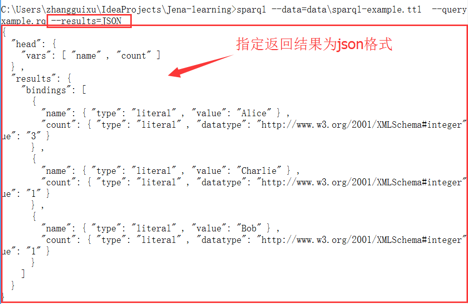
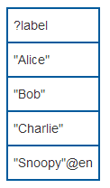
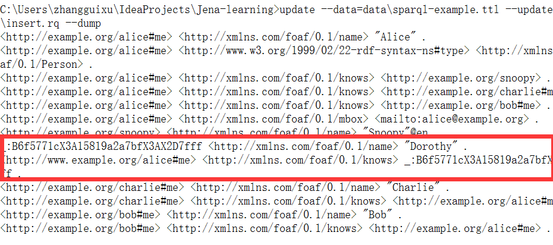

# SPARQL

[中文学习文档](http://www.chinaw3c.org/REC-sparql11-overview-20130321-cn.html)
[搭建测试环境](http://jena.apache.org/tutorials/sparql_query1.html)

## 1. 概述

SPARQL 1.1 是一组W3C推荐标准，提供了对Web上或RDF存储（RDF store）中的RDF图内容（graph）进行查询和处理的语言和协议。它包含以下几个部分：

1. 查询语言：一个面向RDF的查询语言
2. 查询结果格式处理：SPARQL查询结果提供了多种格式，例如json，csv，xml等等。
3. 联邦查询：此规范定义了一个SPARQL 1.1查询语言扩展，用来在分布的多个SPARQL端点(endpints)上执行SPARQL查询。
4. Entailment Regimes(蕴含)：此规范定义了RDF Schema，OWL或RIF等蕴含规则下的SPARQL查询语义。
5. update（更新）：一个面向RDF graph的更新语言。
6. RDF协议：该协议定义了一种方法，执行任意的SPARQL查询，并将结果更新到一个SPARQL服务。
7. 服务描述：该规范定义了一个标准方法，用来发现SPARQL服务，并提供了描述SPARQL服务所需要的词汇表。
8. 图存储HTTP协议：相对于完整的SPARQL协议，该文档定义了一个最小子集，基于常用的HTTP协议的操作，管理RDF graph的内容。
9. 测试用例：这是一组测试，帮助理解规范，并检测一个系统是否符合SPARQL 1.1规范。

## 2. 搭建sparql测试环境

1. 下载解压包，[下载地址](http://jena.apache.org/)
2. 解压，添加环境变量：JENA_HOME : D:\apache-jena-3.1.0
3. 可以把sparql命令添加到系统变量PATH ： %JENA_HOME%\bat
4. 运行sparql --version检测是否安装成功

安装过程中的问题

出现了Unsupported major.minor version 51.0 
因为使用了过低版本的jdk1.6而出现的问题，换成jdk1.8后问题解决；

有了这个之后，就可以进行sparql查询的练习，例如，我们使用[Turtle](https://www.w3.org/TeamSubmission/turtle/)来表示Alice的信息，有

```
@prefix foaf: <http://xmlns.com/foaf/0.1/> .
@prefix rdfs: <http://www.w3.org/2000/01/rdf-schema#> .
<http://example.org/alice#me> a foaf:Person .
<http://example.org/alice#me> foaf:name "Alice" .
<http://example.org/alice#me> foaf:mbox <mailto:alice@example.org> .
<http://example.org/alice#me> foaf:knows <http://example.org/bob#me> .
<http://example.org/bob#me> foaf:knows <http://example.org/alice#me> .
<http://example.org/bob#me> foaf:name "Bob" .
<http://example.org/alice#me> foaf:knows <http://example.org/charlie#me> .
<http://example.org/charlie#me> foaf:knows <http://example.org/alice#me> .
<http://example.org/charlie#me> foaf:name "Charlie" .
<http://example.org/alice#me> foaf:knows <http://example.org/snoopy> .
<http://example.org/snoopy> foaf:name "Snoopy"@en .
```

然后使用sparql查询语句，对其进行查询，查询的执行命令为

```sql
sparql --data=sparql-exampe.ttl --query=example.rq --results=JSON
```

其中

* data : 数据集（rdf/ttl等）
* query : 查询脚本
* results : 指定返回格式，有text,XML,JSON,CSV,TSV,Graph，默认是表格形式

那么接下来，就了解一下如何使用sparql来操作这个数据，

## 3. SPARQL 1.1 查询语言

一段简单的sparql查询如下：

```
PREFIX foaf: <http://xmlns.com/foaf/0.1/>
SELECT ?name (COUNT(?friend) AS ?count)
WHERE {
 ?person foaf:name ?name .
 ?person foaf:knows ?friend .
} GROUP BY ?person ?name
```

sparql 1.0查询包括了

* 联表查询(union)
* 可选查询部分(optional query parts)
* 过滤器(filters)

sparql 1.1查询有新增了

* 子查询(subqueries)
* 赋值(value assignment)
* 路径表达(path expression)
* 聚合查询(aggregates)

除了`SELECT`查询之外，还支持的查询有

* ASK查询，返回值为yes/no值
* CONSTRUCT查询，根据查询结果构造RDF图

### 4. SPARQL 的不同查询结果格式

在SPARQL语言中，SELECT查询的返回结果包含一组从变量到RDF项（RDF terms）的映射，通常以表格的方式表达。


为了以机器可读的方式交换这些查询结果，SPARQL支持四种常见的交换格式：

* XML
* JSON
* CSV
* TSV




### 5. SPARQL 1.1 联邦查询(Federated Query)

联邦查询指的是能够显示地将指定的查询代理给另一个SPARQL端点。

举例来说，在上面的例子，如果要知道Alice的朋友中有谁和DBpedia的资源描述符IRI\<http://depedia.org/resource/Snoopy\>具有相同的名字。为了完成这一查询，需要将获得朋友名字的查询发送给一个地址为`http://dbpedia.org/sparql`的SPARQL端点，通过`SERVICE`关键字找出具有名字\<http://depedia.org/resource/Snoopy\>，具体查询为

```
PREFIX foaf: <http://xmlns.com/foaf/0.1/>
SELECT ?name
WHERE {
 <http://example.org/alice#me> foaf:knows [ foaf:name ?name ] .
 SERVICE <http://dbpedia.org/sparql> { <http://dbpedia.org/resource/Snoopy> foaf:name ?name }
}
```

其中，查询的模式的第一部分位于查询的 WHERE 部分，这部分仍然匹配的是本地的SPARQL服务，而后续对模式的处理，则通过SERVICE关键字代理给指定的远程SPARQL服务。

### 6. 蕴含机制(Entailment Regimes)

SPARQL可以与RDF Schema或OWL Axioms等本体信息一起使用。SPARQL 1.1蕴含规范定义了在不同的蕴含规则下，如何对这种查询做出响应，定义的蕴含规则包括 RDF、RDF Schema、D-Entailment (RDF-MT)、OWL (OWL2-Overview)，及RIF (RIF-Overview)。

举例来说，假定在Alice的数据之外，还有基于RDF Schema和OWL描述的本体信息FOAF词汇表，里面有内容为

```
@prefix foaf: <http://xmlns.com/foaf/0.1/> .
@prefix rdfs: <http://www.w3.org/2000/01/rdf-schema#> .
foaf:name rdfs:subPropertyOf rdfs:label .
```

可以看到`foaf:name`是`foaf:label`的一个子属性，那么由于蕴含机制，查询所有人的标签(labels)，如下

```
SELECT ?label
WHERE {
 ?person rdfs:label ?label
}
```

就会返回



### 7. 更新语言

SPARQL 1.1更新(update)定义了SPARQL 1.1 更新请求的语法和语义，并提供了不同用途的例子，更新操作可以由一组顺序执行的序列组成，对图存储(Graph Store)中的一组图进行更新，对图存储中进行RDF图的更新，创建和删除操作。

注意：使用更新操作，就必须使用`update.bat`或`update`脚本来执行rq文件，语法如下

```
update --data=data.ttl --update=update.rq --dump
```

更新的操作不会保存到文件里面，而是在内存中改变，`--dump`可以将其内存中改变后的模型打印到控制台，然后也可以通过管道保存到文件中。

一个insert的例子

```
PREFIX foaf: <http://xmlns.com/foaf/0.1/>
INSERT DATA { <http://www.example.org/alice#me> foaf:knows [ foaf:name "Dorothy" ]. } ;
```



### 8. SPARQL 1.1 协议

面向RDF查询的SPARQL 1.1协议定义了如何通过HTTP协议，将一个SPARQL 1.1查询及请求发送给一个SPARQL服务。该文档也定义了如何将这些请求映射为HTTP GET和POST操作，以及这些请求的HTTP响应。

### 9. SPARQL 1.1 服务描述

SPARQL 1.1服务描述文档给出了一种发现基于SPARQL 1.1协议的SPARQL服务的方法，以及一个描述SPARQL服务的词汇表。

在这份文档中，当一个SPARQL的服务端点(Service Endpoint)收到不包含任何查询或更新请求的HTTP GET请求时，应当返回一个关于该服务的 RDF描述。例如，当如下的HTTP请求

```
GET /sparql/ HTTP/1.1
Host: www.example.org
```

发送给地址为http://www.example.org/sparql/的SPARQL服务时，应当返回一个基于服务发现词汇表（Service Description Vocabulary）的RDF描述。这些描述可以提供关于该服务端点的默认数据集、所支持的SPARQL查询的功能特性、支持的蕴含种类等信息。

### 10. SPARQL 1.1 图存储的HTTP协议

对许多处理RDF数据的应用程序和服务来说，并不需要完整的SPARQL 1.1更新语言，因此SPARQL1.1图存储HTTP协议提供了一种基于HTTP的操作实现管理一组图数据的部分操作的方法。

例如，在前面的向RDF插入一个三元组，在支持SPARQL 1.1图存储HTTP协议的SPARQL服务上，这个插入操作可以直接通过执行一个 HTTP POST 将其载荷（payload）作为RDF元组直接插入RDF图，而无需发送一个完整的SPARQL 1.1更新请求。

```
POST /rdf-graphs/service?graph=http%3A%2F%2Fwww.example.org%2Falice HTTP/1.1
Host: example.org
Content-Type: text/turtle
@prefix foaf: <http://xmlns.com/foaf/0.1/> .
<http://www.example.org/alice#me> foaf:knows [ foaf:name "Dorothy" ] .
```

在SPARQL 1.1图存储HTTP协议中，还定义了其他用于修改目的的直接HTTP修改RDF图（如用HTTP PUT替换整个图，用HTTP DELETE删除一个RDF图等）或获取RDF图（如通过HTTP GET）等。可以将这一组协议看作结合SPARQL 1.1查询 和SPARQL 1.1更新的完整SPARQL 1.1协议的一个轻量级替代版。